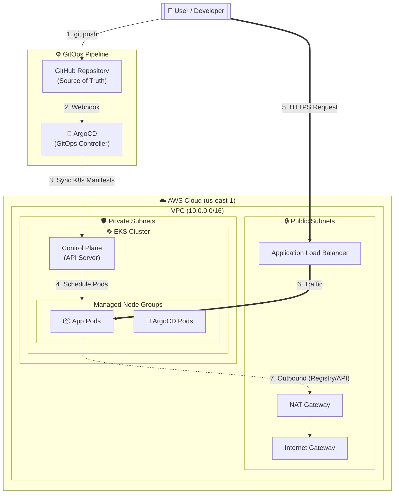

# Kubernetes GitOps Platform

An enterprise-grade Internal Developer Platform (IDP) built on AWS EKS, managed completely via Infrastructure as Code (Terraform) and GitOps (ArgoCD).

## 🚀 Project Overview

The goal of this project is to demonstrate a production-ready approach to Kubernetes infrastructure. It moves beyond simple "cluster creation" to building a fully integrated platform that handles networking, compute, and application release automation.

### Key Features
- **Modular Infrastructure**: Reusable Terraform modules for VPC and EKS.
- **GitOps Engine**: ArgoCD bootstrapping for application lifecycle management.
- **Secure by Default**: Private networking, encrypted secrets, and granular IAM roles.
- **Cost optimized**: Managed Node Groups with Spot instance support (configurable).

## 🏗 Architecture



## 📂 Repository Structure

```text
k8s-gitops-platform/
├── infrastructure/         # Terraform Infrastructure Code
│   ├── modules/            # Reusable components (VPC, EKS)
│   └── environments/       # Environment instantiations (dev, prod)
├── bootstrap/              # Cluster Bootstrapping Scripts
│   └── argocd/             # GitOps Engine Installation
└── README.md
```

## 🛠 Quick Start

### Prerequisites
- AWS CLI configured
- Terraform v1.0+
- `kubectl`

### 1. Provision Infrastructure

```bash
cd infrastructure/environments/dev
terraform init
terraform apply
```

### 2. Configure Access

After Terraform completes, configure `kubectl`:

```bash
aws eks --region us-east-1 update-kubeconfig --name k8s-gitops-dev
```

### 3. Bootstrap GitOps

Install ArgoCD to start the GitOps engine:

```bash
./bootstrap/argocd/install.sh
```

## 🧪 Modules

| Module | Description |
|--------|-------------|
| **VPC** | Custom VPC with EKS-specific tagging for Load Balancer discovery. |
| **EKS** | Managed Control Plane, Node Groups, and IRSA (IAM for Service Accounts). |
